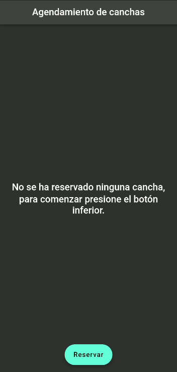
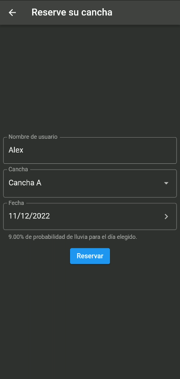
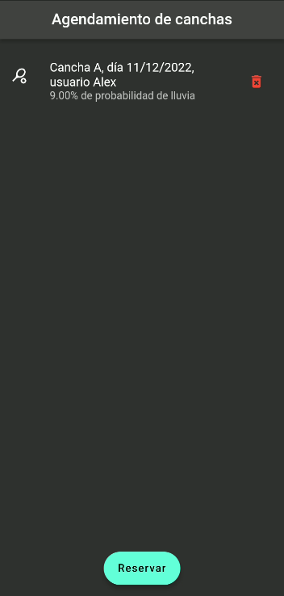
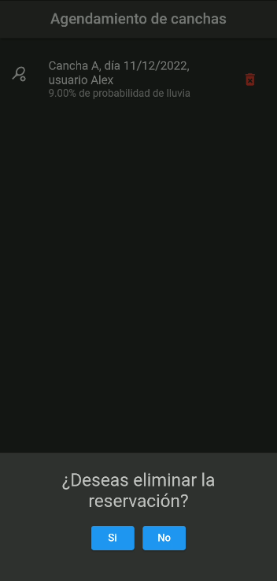
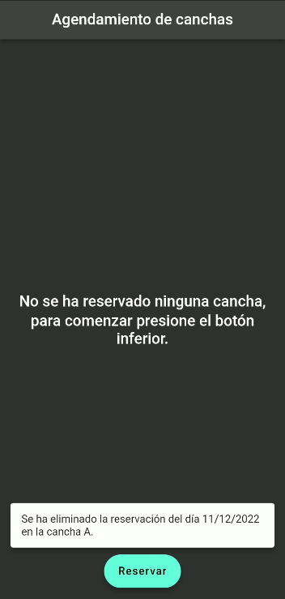

# Prueba técnica 11/12/2022

## Agendamiento de canchas
El objetivo de esta prueba es hacer una aplicación Flutter que una persona pueda utilizar para manejar el agendamiento de tres canchas de tenis. Los requisitos son los siguientes:

1. Cada cancha puede ser agendada máximo tres veces en un día específico.

2. La aplicación debe almacenar la información del agendamiento localmente en la aplicación, si la aplicación es removida del celular entonces la información se pierde.

3. Las tres canchas que se pueden agendar son la A, B y C.

4. En la pantalla principal debe mostrar todos los agendamientos ordenados por fecha, donde el primero debe ser el próximo agendamiento. La lista debe mostrar el nombre de la cancha, la fecha y el nombre del usuario que realizó el agendamiento. También debe mostrar el porcentaje de probabilidad de lluvia para este día, más detalles luego. El elemento de la lista debe poseer un botón para borrar el agendamiento, al hacer clic debe mostrar un mensaje que confirme si desea borrar el agendamiento.

5. Debe tener un botón que permita agregar un agendamiento. La pantalla para agregar el agendamiento debe permitir seleccionar la cancha, y fecha del agendamiento y el nombre de la persona realizando el agendamiento. Se debe validar que para esa fecha la cancha aun posee disponibilidad. Al seleccionar la fecha debe mostrarle el porcentaje de probabilidad de lluvia para ese día.

6. La aplicación debe estar escrita en Dart. Para el manejo de los estados entre widgets puede usar bloc o providers, con el que se sienta más cómodo.

7. Utilizar un patron o arquitectura de desarrollo para la organización y estructura del proyecto (+ si es basada en Clean Architecture).

8. En cuanto al diseño puede ser creativo. Algo simple, pero amigable.

9. Implementar unit tests.

Para consultar el porcentaje de probabilidad de lluvia, puede consultar diferentes servicios REST que son gratuitos o con una quota. Puede asignarle a cada cancha la misma ubicación pues están una al lado de la otra. Un ejemplo de uno de estos API es https://darksky.net/dev/docs, pero puede utilizar cualquier otro API que provea la información.

# Screenshots

  
  
  
  
  

